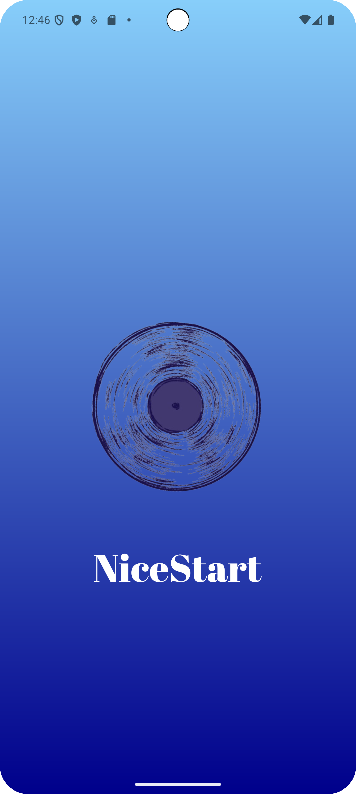
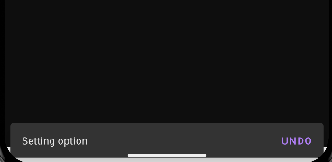
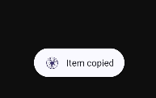
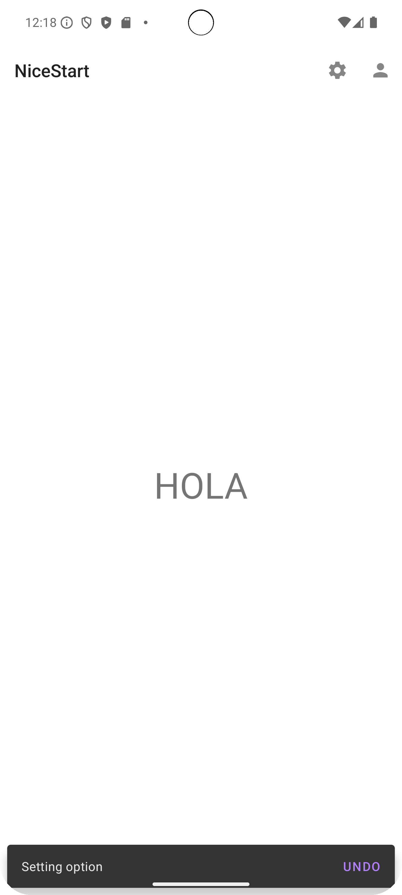
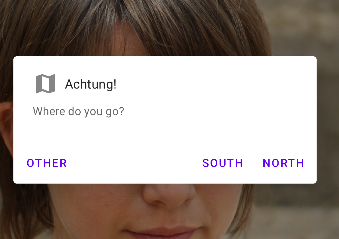
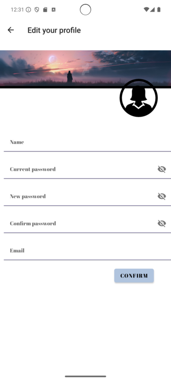

# PROYECTO DE COMIENZO: NICESTART

We have six activities/interactions until now: **SPLASH**, **LOGIN**,  **SIGN UP**, **MAIN**, **PROFILE** and **EDIT PROFILE**. 

## SPLASH: 
Firstly, when opening the app, it shows the splash activity, 
which then will be automatically redirect to Login.

## LOGIN: 

## SIGN UP: 

Both activities are **related**: 

### In login activity: 
    android:onClick="openSignUp"
### Important code to know: 
    public void openSignUp(View view) {
        Intent intent1 = new Intent(Login.this, SignUp.class);
        startActivity(intent1);
    }

## Main: 
In this activity, I am testing some functions as the SnackBar:

    `Snackbar snackbar1 = Snackbar.make(mLayout, "Action is done", Snackbar.LENGTH_SHORT);
    snackbar1.show();`

 

Toast function, which pops up with some information:

    `Toast.makeText(this, "Item copied", Toast.LENGTH_SHORT).show();`

It now has a WebView which refresh an image of a web: 

    `miVisorWeb = (WebView) findViewById(R.id.vistaweb);
    WebSettings webSettings = miVisorWeb.getSettings();
    webSettings.setLoadWithOverviewMode(true);
    webSettings.setUseWideViewPort(true);
    miVisorWeb.loadUrl("https://thispersondoesnotexist.com");`

Another new function, is the Swipe Refresh Layout: 

    `protected SwipeRefreshLayout.OnRefreshListener
        mOnRefreshListener = new SwipeRefreshLayout.OnRefreshListener() {
            @Override
            public void onRefresh() {
                miVisorWeb.reload();
                swipeLayout.setRefreshing(false);
        }
    };`

It looks like this:

At the top of the page, there is a menu Appbar:

    `public  boolean onCreateOptionsMenu(Menu menu){
    getMenuInflater().inflate(R.menu.menu_appbar, menu);
    return true;
    }`

    public boolean onOptionsItemSelected(MenuItem item) {
        int id = item.getItemId();
        final ConstraintLayout mLayout=findViewById(R.id.main);

        if(id == R.id.item3){
            //more code
        } else if (id==R.id.item4) {
            Intent intent=new Intent(this, Profile.class);
            startActivity(intent);
        } else if (id==R.id.item5) {
            showAlertDialogButtonClicked(Main.this);
        }
        return super.onOptionsItemSelected(item);
    }

It has some code of other functions:

Clicking on the map icons, **Alert Dialog**: 

`public void showAlertDialogButtonClicked(Main main){
    MaterialAlertDialogBuilder builder = getMaterialAlertDialogBuilder();
    builder.setNegativeButton("South", new DialogInterface.OnClickListener() {
    @Override
        public void onClick(DialogInterface dialogInterface, int i) {
T           oast.makeText(Main.this, "Let's go!", Toast.LENGTH_SHORT).show();
        }
    });`

    builder.setNeutralButton("Other", new DialogInterface.OnClickListener() {
            @Override
            public void onClick(DialogInterface dialogInterface, int i) {
                Toast.makeText(Main.this, "Let's go!", Toast.LENGTH_SHORT).show();
            }
        });

        AlertDialog dialog = builder.create();
        dialog.show();
    }

    private @NonNull MaterialAlertDialogBuilder getMaterialAlertDialogBuilder() {
        MaterialAlertDialogBuilder builder = new MaterialAlertDialogBuilder(this);
        builder.setTitle("Achtung!");
        builder.setMessage("Where do you go?");
        builder.setIcon(R.drawable.map_icon);
        builder.setCancelable(false);

        builder.setPositiveButton("North", new DialogInterface.OnClickListener() {
            @Override
            public void onClick(DialogInterface dialogInterface, int i) {
                Toast.makeText(Main.this, "Let's go!", Toast.LENGTH_SHORT).show();
            }
        });
        return builder;
    }

You can go to your profile by clicking the person icon: 

## Profile: 

This activity adds the name you've introduced by editing the profile. 
It includes an edit button which sends you to this: 

## Edit profile: 

Each activity has a glide, which can access to an image from the internet, your local file, etc... 
It has some properties. For example, main activity has a profile image which firstly wasn't rounded:

    .load("https://uxwing.com/wp-content/themes/uxwing/download/peoples-avatars/default-profile-picture-female-icon.png")
    .transition(DrawableTransitionOptions.withCrossFade(1000))
    .circleCrop()
    .into(prof);

That's it for now, **we'll be upgrading it!!**
