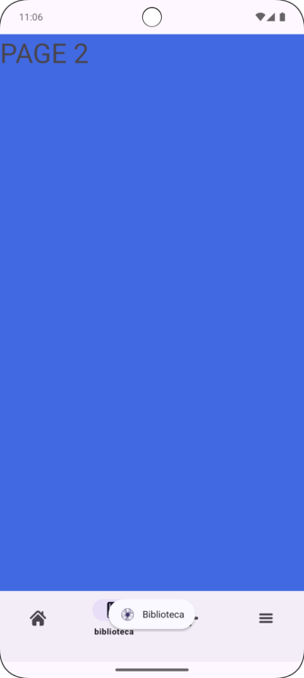
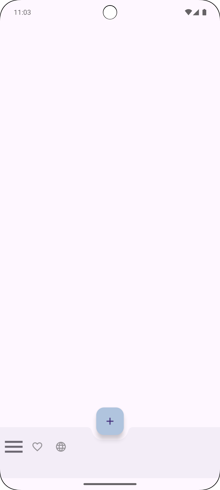

# PROYECTO DE COMIENZO: NICESTART
Tiene 6 activities: **SPLASH**, **LOGIN**,  **SIGN UP**, **MAIN**, **PROFILE** y **EDIT PROFILE**. 

## SPLASH: 
Al abrir la app, se carga el Splash, que pasado unos segundos, carga el login automaticamente.

## LOGIN: 

## SIGN UP: 

Ambas activities estan **relacionadas**: 

### In login activity: 

    android:onClick="openSignUp"

### Important code to know: 

    public void openSignUp(View view) {
        Intent intent1 = new Intent(Login.this, SignUp.class);
        startActivity(intent1);
    }

## Main: 
En esta actividad se prueban varias funcionalidades:

    Snackbar snackbar1 = Snackbar.make(mLayout, "Action is done", Snackbar.LENGTH_SHORT);
    snackbar1.show();

 

La función toast, que muestra un pop up de texto:

    Toast.makeText(this, "Item copied", Toast.LENGTH_SHORT).show();

Además, tiene un webview: 

    miVisorWeb = (WebView) findViewById(R.id.vistaweb);
    WebSettings webSettings = miVisorWeb.getSettings();
    webSettings.setLoadWithOverviewMode(true);
    webSettings.setUseWideViewPort(true);
    miVisorWeb.loadUrl("https://thispersondoesnotexist.com");

Cambia de imagen al recargar la página: 

    protected SwipeRefreshLayout.OnRefreshListener
        mOnRefreshListener = new SwipeRefreshLayout.OnRefreshListener() {
            @Override
            public void onRefresh() {
                miVisorWeb.reload();
                swipeLayout.setRefreshing(false);
        }
    };

Se ve así:

Arriba de la página, hay un menu Appbar:

    public  boolean onCreateOptionsMenu(Menu menu){
    getMenuInflater().inflate(R.menu.menu_appbar, menu);
    return true;
    }

    public boolean onOptionsItemSelected(MenuItem item) {
        int id = item.getItemId();
        final ConstraintLayout mLayout=findViewById(R.id.main);

        if(id == R.id.item3){
            //more code
        } else if (id==R.id.item4) {
            Intent intent=new Intent(this, Profile.class);
            startActivity(intent);
        } else if (id==R.id.item5) {
            showAlertDialogButtonClicked(Main.this);
        }
        return super.onOptionsItemSelected(item);
    }

**Funciones:**

Al clicar en el icono del mapa, muestra un **Alert Dialog**: 
    
    public void showAlertDialogButtonClicked(Main main){
        MaterialAlertDialogBuilder builder = getMaterialAlertDialogBuilder();
        builder.setNegativeButton("South", new DialogInterface.OnClickListener() {
        @Override
            public void onClick(DialogInterface dialogInterface, int i) {
                Toast.makeText(Main.this, "Let's go!", Toast.LENGTH_SHORT).show();
            }
        });

        builder.setNeutralButton("Other", new DialogInterface.OnClickListener() {
            @Override
            public void onClick(DialogInterface dialogInterface, int i) {
                Toast.makeText(Main.this, "Let's go!", Toast.LENGTH_SHORT).show();
            }
        });

        AlertDialog dialog = builder.create();
        dialog.show();
    }

    private @NonNull MaterialAlertDialogBuilder getMaterialAlertDialogBuilder() {
        MaterialAlertDialogBuilder builder = new MaterialAlertDialogBuilder(this);
        builder.setTitle("Achtung!");
        builder.setMessage("Where do you go?");
        builder.setIcon(R.drawable.map_icon);
        builder.setCancelable(false);

        builder.setPositiveButton("North", new DialogInterface.OnClickListener() {
            @Override
            public void onClick(DialogInterface dialogInterface, int i) {
                Toast.makeText(Main.this, "Let's go!", Toast.LENGTH_SHORT).show();
            }
        });
        return builder;
    }

Si clicas en el icono del perfil, te redirige al perfil de usuario: 

## Profile: 

Esta actividad muestra el nombre que hayas introducido al editar el perfil. 
Para ello, debes clicar en el icono de editar: 

## Edit profile: 

Cada actividad tiene un **glide**, que permite el acceso a internet, archivos locales, etc... 
Tiene algunas propiedades. Por ejemplo, la main activity tiene una imagen que no era redonda de primeras:

    .load("https://uxwing.com/wp-content/themes/uxwing/download/peoples-avatars/default-profile-picture-female-icon.png")
    .transition(DrawableTransitionOptions.withCrossFade(1000))
    .circleCrop()
    .into(prof);

## Menu bottom navigation y AppBar:

Accedemos a estas activities a traves del main: 

    `else if(id==R.id.item6){
        Intent intent=new Intent(this, MainBn.class);
        startActivity(intent);
    } else if(id==R.id.item7){
        Intent intent=new Intent(this, MainBab.class);
        startActivity(intent);
    }`

El mainBn es una activity que tiene un view pager y un bottom navigation. 
Con los botones de este menu, nos movemos por unos fragments que se muestran en el view pager:

El mainBab es un activity con un menu bottom AppBar. Así se ve:

Por ahora se ve así, **¡iremos actualizando!**
