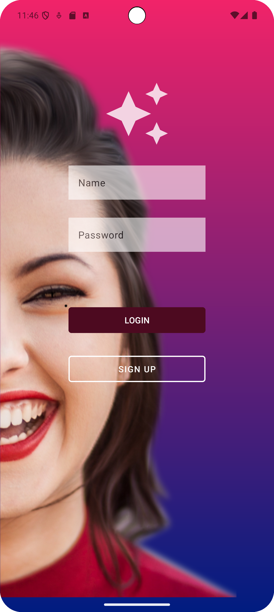
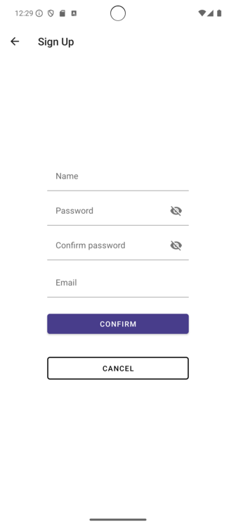

# PROYECTO DE COMIENZO: NICESTART

Hasta ahora tenemos dos actividades: **LOGIN** y **SIGN UP**. 

## LOGIN: 

## SIGN UP: 

Ambas actividades están **relacionadas**: 

### En el login activity: 
    android:onClick="openSignUp"
### Código importante para relacionarlas: 
    public void openSignUp(View view) {
        Intent intent1 = new Intent(Login.this, SignUp.class);
        startActivity(intent1);
    }
Todavía estamos empezando, _**¡queda mucho!**_