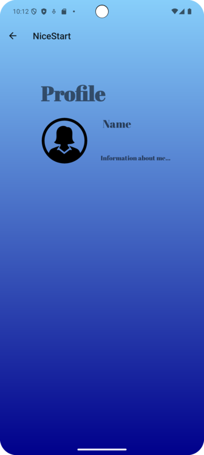

# PROYECTO DE COMIENZO: NICESTART

We have three activities until now: **LOGIN**,  **SIGN UP** y **MAIN**. 

## LOGIN: 

## SIGN UP: 

Both activities are **related**: 

### In login activity: 
    android:onClick="openSignUp"
### Important code to know: 
    public void openSignUp(View view) {
        Intent intent1 = new Intent(Login.this, SignUp.class);
        startActivity(intent1);
    }

## MAIN: 

This activity will probably will be refactor to profile instead.

Each activity has a glide, which can access to an image from the internet, your local file, etc... 
It has some properties. For example, main activity has a profile image which firstly wasn't rounded:

    .load("https://uxwing.com/wp-content/themes/uxwing/download/peoples-avatars/default-profile-picture-female-icon.png")
    .transition(DrawableTransitionOptions.withCrossFade(1000))
    .circleCrop()
    .into(prof);

That's it for now, **we'll be upgrading it!!**
